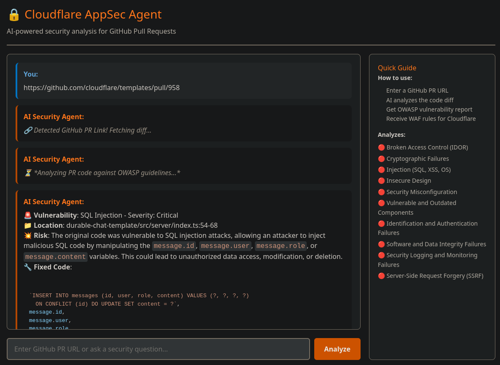

# Cloudflare AppSec Agent

[](https://developers.cloudflare.com/workers-ai/)
[](https://developers.cloudflare.com/agents/)
[](https://www.typescriptlang.org/)
[](https://react.dev/)
[](https://owasp.org/www-project-top-ten/)

> A "Shift-Left Security" tool that integrates GitHub, AI security analysis, and automatic Cloudflare WAF rule generation to catch vulnerabilities before production.

---

## 🎯 Description

**Cloudflare AppSec Agent** is an autonomous AI-powered security reviewer that analyzes GitHub Pull Requests in real-time. It proactively identifies OWASP Top 10 vulnerabilities (XSS, SQLi, IDOR, hardcoded secrets, and more) directly from code diffs.

What sets this apart? Instead of just flagging issues, it:

- **Suggests actual code fixes** for vulnerable patterns
- **Automatically generates Cloudflare WAF rules** to mitigate the vulnerability in production
- **Provides instant security feedback** during the development lifecycle

---

## Live Demo



Try the agent right now:
[Analyze a PR on the Live App](https://divine-hill-4709.paulodgb2006.workers.dev)

(Note: The live demo works best with public GitHub PRs. For private repos, follow the [local installation below](#installation).)

---

## Key Features

### **GitHub Integration**

- Analyzes GitHub Pull Requests on-demand via a conversational interface
- Extracts raw code diffs using GitHub API (`Accept: application/vnd.github.v3.diff`)
- Analyzes added/modified code paths for security vulnerabilities

### **OWASP Top 10 Analysis**

- **Cross-Site Scripting (XSS)**: Detects unescaped user input in HTML/JS contexts
- **SQL Injection (SQLi)**: Identifies string concatenation in database queries
- **IDOR (Insecure Direct Object References)**: Finds missing authorization checks
- **Hardcoded Secrets**: Scans for API keys, tokens, and credentials
- **Additional patterns**: XSS via innerHTML, eval() usage, path traversal, and more

### **AI-Powered Security Analysis**

- Uses **Workers AI** with Llama 3.3 model for intelligent code analysis
- Context-aware vulnerability detection with explanation
- Generates human-readable security reports with severity levels

### **Auto-WAF Rule Generation**

- Synthesizes precise Cloudflare WAF Custom Rules in the chat that engineers can immediately deploy
- Provides both **detection** and **protection** in one cohesive flow
- Rules target specific vulnerability patterns with precision

### **Conversational Interface**

- Real-time chat interface via WebSockets using Durable Objects
- Ask follow-up questions about vulnerabilities
- Request custom WAF rule tuning or alternative fixes

---

## 🏗️ Architecture

```
┌─────────────────────────────────────────────────────────────────┐
│                    GitHub Pull Request                          │
│                (Webhook / API Integration)                      │
└──────────────────────────┬──────────────────────────────────────┘
                           │
                           ▼
┌─────────────────────────────────────────────────────────────────┐
│              Cloudflare Worker (Entry Point)                    │
│          - HTTP routes for GitHub webhooks                      │
│          - Authentication & request validation                  │
└──────────────────────────┬──────────────────────────────────────┘
                           │
                           ▼
┌─────────────────────────────────────────────────────────────────┐
│              Durable Object (ChatAgent)                         │
│          - WebSocket coordination & state management            │
│          - SQLite persistence for chat history                  │
│          - Session affinity for real-time updates               │
└──────────────────────────┬──────────────────────────────────────┘
                           │
                           ▼
┌─────────────────────────────────────────────────────────────────┐
│              Workers AI (Llama 3.3)                             │
│          - Code diff analysis for OWASP vulnerabilities         │
│          - Security report generation                           │
│          - WAF rule synthesis                                   │
└──────────────────────────┬──────────────────────────────────────┘
                           │
            ┌─────────────────────────────┐
            │                             │
            ▼                             ▼
    ┌───────────────┐             ┌────────────────┐
    │  React Client │ ◄─────────► │  AppSec Agent  │
    │   (Chat UI)   │  WebSockets │    (Backend)   │
    └───────────────┘             └────────────────┘
```

### Technology Stack

| Component                 | Purpose                                               |
| ------------------------- | ----------------------------------------------------- |
| **Cloudflare Agents SDK** | Orchestration, tool invocation, and memory management |
| **Workers AI**            | LLM inference for security analysis                   |
| **Durable Objects**       | Stateful WebSocket sessions and SQLite storage        |
| **GitHub API**            | Fetch raw PR diffs on demand                          |
| **TypeScript**            | Type-safe backend development                         |
| **React + useAgent**      | Real-time frontend with WebSocket streaming           |

---

## Prerequisites & Setup

### Requirements

- **Node.js** ≥ 20.x
- **npm** ≥ 9.x
- **Cloudflare account** with Workers & AI enabled
- **GitHub Personal Access Token** (for API access)

### Installation

1. **Clone the repository**

   ```bash
   git clone https://github.com/paulobarb/cf_ai_appsec_agent.git
   cd cf_ai_appsec_agent
   ```

2. **Install dependencies**

   ```bash
   npm install
   ```

3. **Configure environment variables**
   Copy the `.env.example` file to create your local `.env` file

   ```bash
    cp .env.example .env
   ```

   Change your credentials:

   ```env
   GITHUB_TOKEN=ghp_your_github_token_here
   ```

4. **Start local development**

   ```bash
   npm run dev
   ```

   The chat interface will be available at `http://localhost:5173`.

### Deployment

Deploy to Cloudflare Workers:

```bash
npm run deploy
```

---

## 💡 Use Cases

### For Development Teams

- **Pre-commit security scanning**: Catch vulnerabilities before code review
- **On-demand analysis**: `@appsec-bot scan for XSS in this PR`
- **Security education**: Learn why code patterns are risky with AI explanations

### For Security Teams

- **Automated triage**: AI prioritizes high-risk PRs for manual review
- **WAF rule acceleration**: Auto-generate rules for immediate protection
- **Compliance auditing**: Log all security findings for compliance

### Example Workflow

```
1. Security engineer pastes a GitHub PR URL into the AppSec Agent chat.
2. Agent fetches the raw code diff using the GitHub API.
3. Agent analyzes the diff using Llama 3.3.
4. Agent responds in chat: "WARNING: SQL Injection vulnerability detected on line 42."
5. Agent suggests secure code replacement (e.g., parameterized queries).
6. Agent generates the exact Cloudflare WAF JSON expression to block the attack.
```

---

## 📈 Future Roadmap

Next iterations could include:

- **CI/CD Integration**: GitHub Actions
- **Custom Rules Engine**: Organization-specific security policies
- **Multi-model Support**: Fine-tuned security models per vulnerability type
- **Historical Analysis**: Track security posture trends over time
- **Team Dashboards**: Security metrics and leaderboards
- **GitHub App Integration**: Listen to webhooks to automatically comment on PRs instead of requiring manual chat input.
- **WAF API Auto-Deployment**: Use Cloudflare's API to push the generated WAF rules directly to staging environments with one click.

---

## License

MIT License - see [LICENSE](LICENSE) for details.
